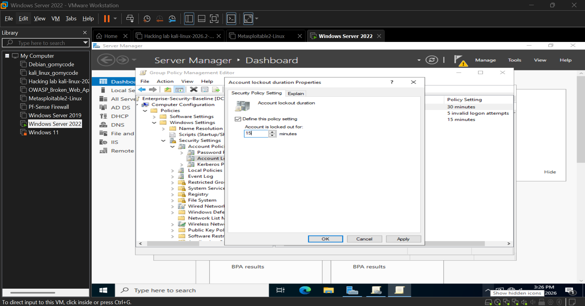
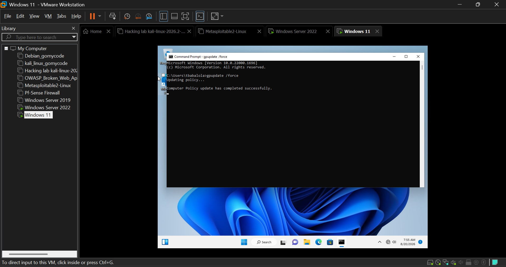
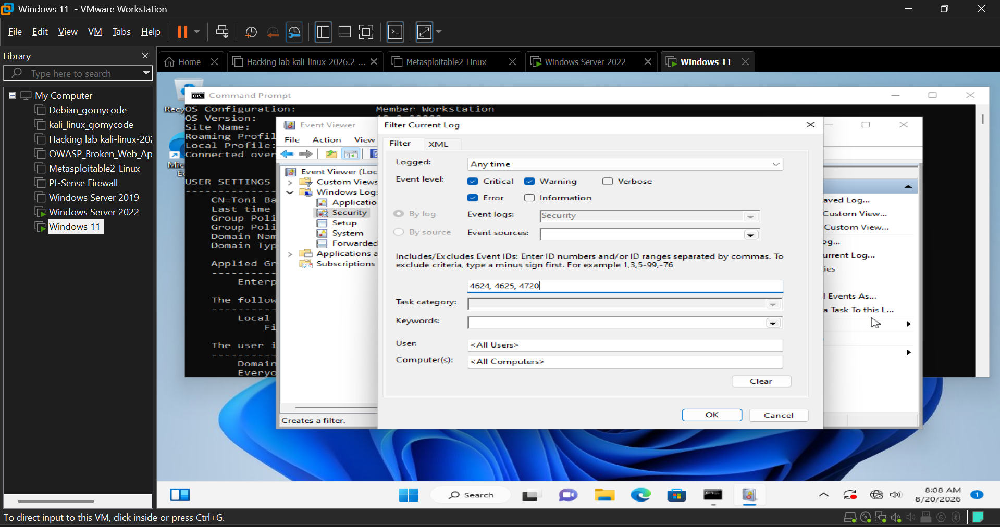

This project documents the step-by-step setup of a Windows Server 2022 virtual machine in VMware Workstation, configured as a Domain Controller. The walkthrough covers VM creation, OS installation, VMware Tools setup, network verification, and concludes with successfully joining a Windows 11 client to the domain.

## 🛡️ Day 8: Enterprise GPO Hardening & Security Event Auditing

### 1. Account Lockout & Password Defense (DC-01)
Configured an enterprise security baseline GPO linked to `Ugo Company LTD` enforcing an Account Lockout threshold of 5 attempts.

---

### 2. Policy Synchronization & Enforcement (Windows 11 Client)
Verified policy propagation on the Windows 11 endpoint (`HQ`) via `gpupdate /force` and audited applied policies using `gpresult /r`.

---

### 3. SIEM-Ready Security Event Auditing (Event IDs 4624 / 4625)
Activated Advanced Security Auditing on `DC-01.ugo.local` to monitor interactive logins and brute-force attempts.

